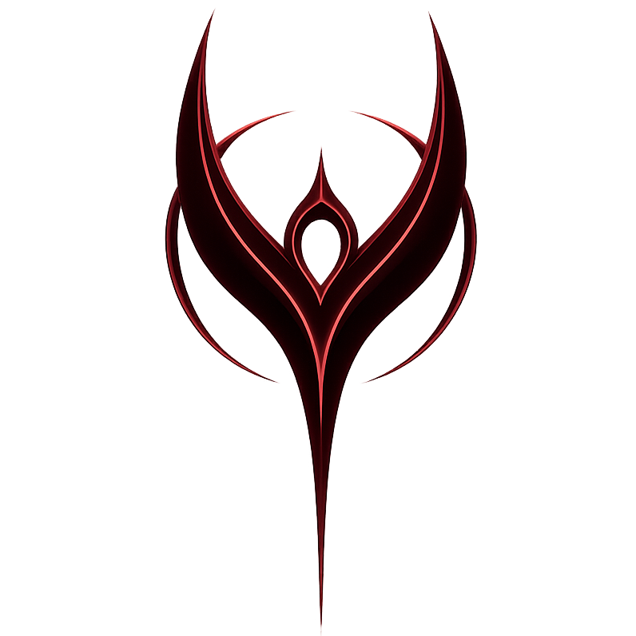

# Nyssa — Personal AI Assistant

<p align="center">
  
</p>

An always-on Windows voice assistant with full PC awareness. Nyssa listens via microphone, watches the active window, and can respond by voice and execute actions on your PC. All memory stays local; only conversation content and any screenshots you trigger are sent to the AI backend.

## Features

- **Push-to-talk** — hold `Space` to speak; no wake word needed
- **Wake word** — say `"hey"` for hands-free activation
- **Screen-aware** — captures a screenshot when context requires it (gaming, "look at this", etc.)
- **Persistent local memory** — remembers facts and past conversations across sessions (SQLite + ChromaDB)
- **PC actions** — types text, presses keys, clicks, runs shell commands (with confirmation), opens URLs
- **Dual AI backends** — Claude API (default) or local Ollama
- **Game-aware** — suppresses accidental activations when a game is in focus
- **Optional overlay UI** — transparent PyQt6 HUD showing assistant state

## Requirements

- Windows 11
- Python 3.11+
- An [Anthropic API key](https://console.anthropic.com/) (or a local [Ollama](https://ollama.com/) instance)

## Installation

```bash
git clone https://github.com/goranstjepanovic/ai-assistant.git
cd ai-assistant
pip install -r requirements.txt
```

For the optional transparent overlay UI:

```bash
pip install PyQt6>=6.6.0
```

## Configuration

Set your API key as an environment variable:

```powershell
$env:ANTHROPIC_API_KEY = "sk-ant-..."
```

All other settings are in `config/settings.json` (created with defaults on first run). Key options:

| Setting | Default | Description |
|---|---|---|
| `hotkey` | `"space"` | Push-to-talk key |
| `wake_word` | `"hey"` | Hands-free trigger phrase |
| `whisper_model` | `"small"` | STT model size (`tiny`/`base`/`small`/`medium`) |
| `tts_voice` | `"en-GB-SoniaNeural"` | Edge TTS voice |
| `ollama_model` | `"gemma4"` | Local model (if using Ollama) |
| `ollama_host` | `"http://localhost:11434"` | Ollama endpoint |

To add game processes for suppression, edit `config/game_processes.json`.

## Usage

```bash
python main.py
```

Hold **Space** and speak, or say **"hey"** followed by your request. Nyssa responds by voice and can take actions on your PC.

Shell commands always require a voice confirmation before executing.

## Project Structure

```
ai-assistant/
├── main.py                  # Entry point
├── config/
│   ├── settings.json        # User config
│   └── game_processes.json  # Known game processes for suppression
├── core/
│   ├── event_bus.py         # Async pub/sub
│   ├── gatekeeper.py        # Activation filter (hotkey, wake word, app class)
│   └── orchestrator.py      # Main AI loop
├── perception/
│   ├── mic_capture.py       # Whisper + VAD pipeline
│   └── window_monitor.py    # Active window detection and classification
├── memory/
│   ├── memory_manager.py    # SQLite + ChromaDB API
│   └── fact_extractor.py    # Extracts facts from conversations
├── actions/
│   ├── action_runner.py     # Tool call dispatcher
│   ├── keyboard.py          # Keypress injection
│   └── tts.py               # Text-to-speech (edge-tts / pyttsx3)
├── ai/
│   ├── claude_client.py     # Anthropic API with tool use loop
│   ├── ollama_client.py     # Local Ollama client
│   ├── tools.py             # Tool definitions
│   └── prompts.py           # System prompt assembly
└── ui/
    └── overlay.py           # Optional PyQt6 HUD
```

## Notes

- Keypress injection into online competitive games is out of scope and not supported.
- The `ANTHROPIC_API_KEY` is read from the environment only — never stored in config files.
- Logs are written to `logs/nyssa.log`.

## License

[MIT](LICENSE)
